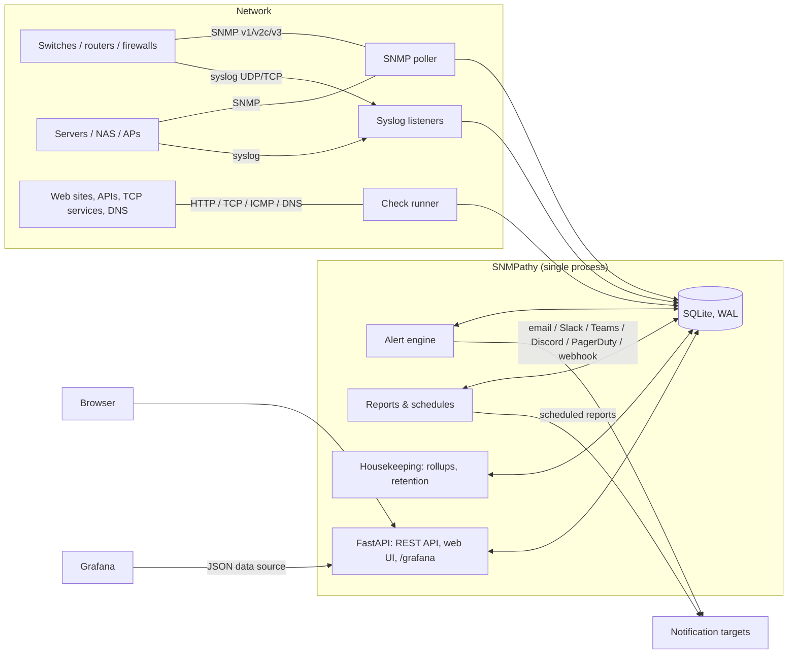
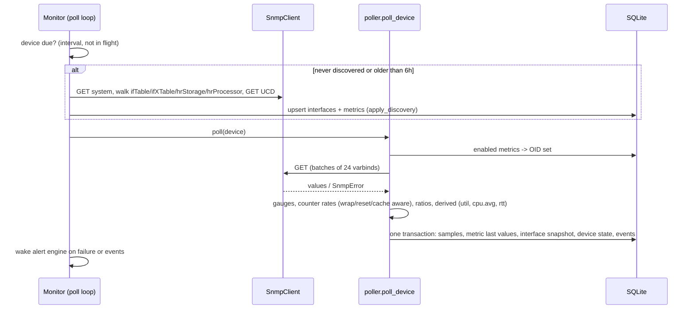
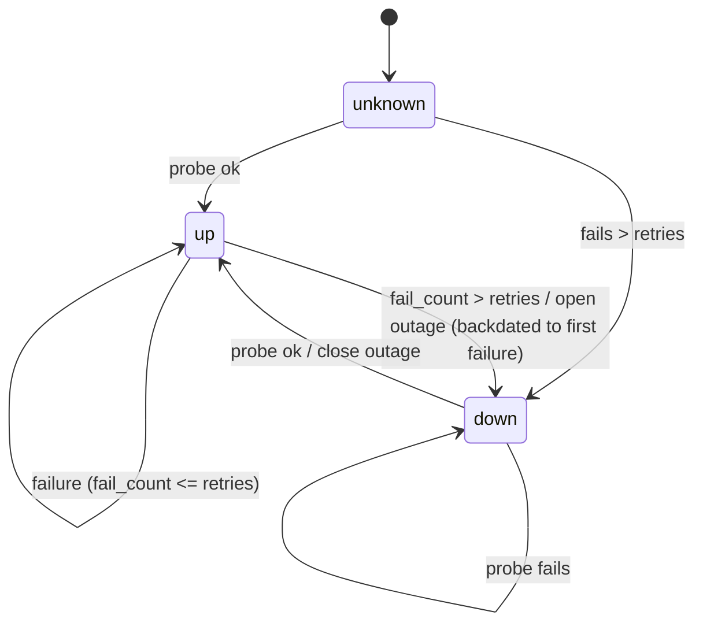
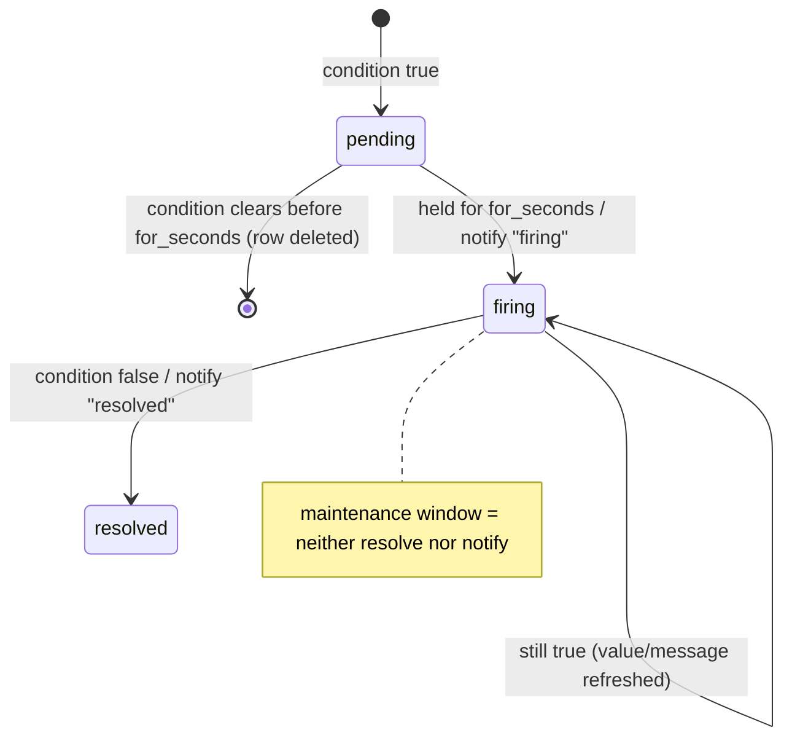
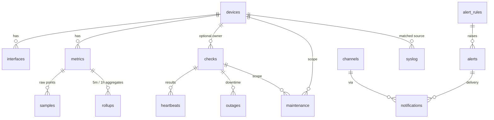
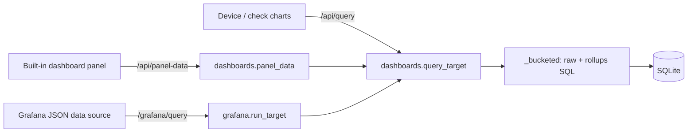

# SNMPathy: Architecture and Requirements

| | |
|---|---|
| **Product** | SNMPathy: self-hosted network monitoring (SNMP polling, syslog ingest, uptime checks, alerting, dashboards, reporting) |
| **Version** | 0.1.0 |
| **Status** | Implemented. This document describes the system as built. |
| **Audience** | Engineers operating, extending or reviewing SNMPathy |

---

## 1. Purpose and scope

SNMPathy gives small and mid-sized network teams one lightweight service that covers the
common jobs of several separate tools:

| Tool it replaces | Capability in SNMPathy |
|---|---|
| Observium / LibreNMS / PRTG | SNMP auto-discovery and polling of interfaces, CPU, memory and storage, with graphs |
| Zabbix | Threshold, availability and log-pattern alerting with notifications |
| Uptime Robot | ICMP / TCP / HTTP / DNS / SNMP availability checks, SLA figures, a public status page |
| ELK (for network logs) | Syslog collection, full-text search, facets and volume histograms |
| Grafana | Built-in editable dashboards, plus a native Grafana data source |

**Design goals:**

1. Installs in minutes on Windows, macOS, Linux or Docker, with no external database,
   message queue or agent.
2. Useful immediately: discovery, default alert rules and ready-made dashboards need no
   configuration.
3. Everything is available over a documented REST API.
4. Small, readable codebase that is easy to extend (about 11.5k lines of Python, JS, CSS and HTML, plus about 1k lines of tests).

**Non-goals** for this version: distributed or multi-site polling, NetFlow / sFlow,
SNMP traps, configuration management (backing up device configs), multi-tenant RBAC,
and horizontal scale-out beyond a single node (see §3.14).

---

## 2. Requirements

Priorities: **M** = must, **S** = should, **C** = could. Every **M** and **S** requirement
listed here is implemented; the *Where* column points to the implementing module and the
covering test.

### 2.1 Functional requirements

#### SNMP monitoring

| ID | Pri | Requirement | Where |
|---|---|---|---|
| FR-SNMP-1 | M | Poll devices over SNMP v1, v2c and v3 (noAuthNoPriv / authNoPriv / authPriv; MD5, SHA-1, SHA-2 auth; DES, 3DES, AES-128/192/256 privacy). | `snmp/client.py`, `tests/test_live_snmp.py` |
| FR-SNMP-2 | M | Auto-discover the system group, vendor (from sysObjectID), interfaces (ifTable + ifXTable), CPU and storage (HOST-RESOURCES-MIB), and load and memory (UCD-SNMP-MIB). | `snmp/discovery.py`, `tests/test_snmp.py` |
| FR-SNMP-3 | M | Prefer 64-bit HC counters, convert counters to rates, and handle 32/64-bit wraparound and counter resets. | `snmp/poller.py::counter_delta` |
| FR-SNMP-4 | M | Derive interface utilisation %, average CPU and SNMP response time. | `snmp/poller.py` |
| FR-SNMP-5 | M | Detect device reboots (sysUpTime going backwards) and interface oper-status changes, recording them as events. | `snmp/poller.py`, `tests/test_snmp.py::test_reboot_and_interface_events` |
| FR-SNMP-6 | M | Mark a device down when it stops answering and record the transition. | `snmp/poller.py::_mark_failure` |
| FR-SNMP-7 | S | Re-discover periodically (6 h) and when credentials change; stop polling vanished series but keep their history. | `monitor.py`, `snmp/discovery.py::apply_discovery` |
| FR-SNMP-8 | S | User-defined custom OIDs per device (gauge, counter, ratio, inverse ratio). | `services.py::add_custom_metric` |
| FR-SNMP-9 | S | Test credentials without saving; CLI `get` / `walk` / `discover` tools that need no net-snmp. | `api.py::test_snmp`, `cli.py` |
| FR-SNMP-10 | S | Reject impossible counter spikes (> 2× line rate) and the zero rates caused by agent counter caching. | `snmp/poller.py` |

#### Syslog

| ID | Pri | Requirement | Where |
|---|---|---|---|
| FR-LOG-1 | M | Receive syslog over UDP and TCP (newline, NUL and RFC 6587 octet-counted framing). | `syslog/server.py`, `tests/test_syslog_server.py` |
| FR-LOG-2 | M | Parse RFC 5424 (including structured data) and RFC 3164, plus real-world variants: Cisco sequence numbers and `%FAC-SEV-MNEMONIC`, ISO timestamps in BSD messages, a missing hostname, a missing PRI. | `syslog/parser.py`, `tests/test_syslog_parser.py` |
| FR-LOG-3 | M | Fall back to receipt time when the device clock is unsynchronised or more than 24 h off. | `syslog/parser.py::_trust` |
| FR-LOG-4 | M | Full-text search (phrases, exclusions, prefixes, boolean operators) with filters on host (wildcards), app, minimum severity, facility, device and time. | `syslog/search.py`, `tests/test_api.py::test_syslog_search_endpoints` |
| FR-LOG-5 | M | Volume histogram by severity band, and top-N facets by host / app / severity. | `syslog/search.py` |
| FR-LOG-6 | S | Associate messages with known devices by source IP or hostname. | `syslog/server.py::_devices` |
| FR-LOG-7 | S | Live tail in the UI. | `web/static/app.js::syslogExplorer` |
| FR-LOG-8 | S | Degrade gracefully to LIKE search when SQLite lacks FTS5. | `db.py::FTS_SCHEMA`, `syslog/search.py::_run` |

#### Availability and uptime

| ID | Pri | Requirement | Where |
|---|---|---|---|
| FR-UP-1 | M | Check types: ICMP ping, TCP connect, HTTP(S) (method, expected status, keyword present / absent, TLS verification, certificate-expiry threshold), DNS resolution (optional expected address) and SNMP agent. | `checks/probes.py`, `tests/test_checks.py` |
| FR-UP-2 | M | Per-check interval, timeout, and *retries before down*; faster re-probing while a check is failing. | `checks/runner.py`, `monitor.py::_check_loop` |
| FR-UP-3 | M | Outage history, backdated to the first failed probe. | `checks/runner.py::record_result` |
| FR-UP-4 | M | Availability %, downtime, outage count, longest outage, MTTR, MTBF and response-time statistics for any window. | `reports.py::availability` |
| FR-UP-5 | M | Exclude maintenance windows from SLA figures, and exclude time before a check existed. | `reports.py`, `tests/test_reports.py` |
| FR-UP-6 | S | 90-day per-day uptime bars and a public, unauthenticated status page of selected checks. | `reports.py::daily_bars`, `/status` |
| FR-UP-7 | M | Automatically create a ping check for each new device (optional). | `services.py::create_device` |

#### Alerting and notification

| ID | Pri | Requirement | Where |
|---|---|---|---|
| FR-AL-1 | M | Rule kinds: metric threshold (`> >= < <= == !=`), check down, device unreachable, and syslog pattern count per host within a window. | `alerting/engine.py`, `tests/test_alerts.py` |
| FR-AL-2 | M | Wildcard metric keys (`if.*_util`) and instance / label globs; scope a rule to a device or a device tag. | `alerting/engine.py` |
| FR-AL-3 | M | Lifecycle pending → firing → resolved, with a "for" duration; a pending alert that clears leaves no trace. | `alerting/engine.py::AlertEngine.evaluate` |
| FR-AL-4 | M | Ignore stale metric data so a silent device does not hold a threshold alert open. | `alerting/engine.py` |
| FR-AL-5 | M | Channels: email (SMTP / SMTPS / STARTTLS), Slack-compatible webhooks, Microsoft Teams, Discord, PagerDuty Events v2 (with dedup key and resolve), a generic JSON webhook, and log. | `alerting/notify.py` |
| FR-AL-6 | M | Maintenance windows (global / device / check) suppress notifications and hold existing alert state. | `alerting/engine.py`, `tests/test_alerts.py` |
| FR-AL-7 | S | Acknowledge alerts, keep a notification delivery log, and send a test message from any channel. | `api.py` |
| FR-AL-8 | S | Evaluate immediately on state changes rather than waiting for the next interval. | `monitor.py::_alert_wakeup` |
| FR-AL-9 | S | Sensible default rules and a log channel on first start. | `services.py::seed_defaults` |

#### Dashboards and visualisation

| ID | Pri | Requirement | Where |
|---|---|---|---|
| FR-DB-1 | M | Built-in, persistent, editable dashboards laid out on a 12-column grid. | `dashboards.py`, `web/static/app.js::SP.dashboard` |
| FR-DB-2 | M | Panel types: time series (lines / area / stacked bars / bars), stat, gauge, top-N table, status grid, uptime bars, syslog volume / stream / top, firing alerts, events, overview counters, text. | `dashboards.py::panel_data` |
| FR-DB-3 | M | Queries select metrics by key, device, tag and instance, with aggregation (each / sum / avg / max / min), a series limit and alias templates; plus check response-time / availability series and syslog count series. | `dashboards.py::query_target` |
| FR-DB-4 | M | View options: time range presets from 15 min to 1 year plus a custom range, auto-refresh, light / dark / system theme, kiosk (TV) mode, panel enlarge, legend isolate / toggle, crosshair tooltips. | `app.js` |
| FR-DB-5 | M | Panel editor with live preview; reorder, resize and duplicate panels; JSON model import / export; duplicate dashboards. | `app.js::panelEditor`, `api.py` |
| FR-DB-6 | M | Five ready-made dashboards: Network Overview, Traffic & Interfaces, Server & Device Health, Availability, Syslog. | `dashboards.py::DEFAULT_DASHBOARDS` |
| FR-DB-7 | S | Automatic resolution: raw samples for ranges up to 2 days, 5-minute rollups up to 21 days, hourly beyond that. | `storage.py::series`, `dashboards.py::_bucketed` |
| FR-DB-8 | S | A colour-vision-deficiency-safe categorical palette (validated for light and dark), and status shown by shape plus label, never by colour alone. | `web/static/app.css` |

#### Grafana integration

| ID | Pri | Requirement | Where |
|---|---|---|---|
| FR-GF-1 | M | Implement the Grafana JSON data source protocol (`simpod-json-datasource`): `/`, `/metrics`, `/metric-payload-options`, `/query`, `/variable`, `/tag-keys`, `/tag-values`. | `grafana.py`, `tests/test_api.py::test_grafana_datasource_protocol` |
| FR-GF-2 | M | Time-series targets (metric, check, syslog), a single-value target (count) and table targets (devices, checks, interfaces, alerts, syslog events, events, top-N). | `grafana.py::run_target` |
| FR-GF-3 | M | Template variables (devices, tags, checks, keys, interfaces, hosts), including Grafana's regex-formatted multi-value interpolation. | `grafana.py::variable`, `grafana_value` |
| FR-GF-4 | M | Five pre-built Grafana dashboards, downloadable from the UI and provisioned automatically in Docker Compose. | `grafana.py::grafana_dashboards`, `deploy/grafana/` |
| FR-GF-5 | S | `snmpathy grafana-export` writes provisioning files for existing Grafana installs. | `cli.py` |

#### Reporting

| ID | Pri | Requirement | Where |
|---|---|---|---|
| FR-RP-1 | M | Availability / SLA report per check against a configurable SLA target, with an outage list. | `reporting.py::uptime_report` |
| FR-RP-2 | M | Device health report: CPU and memory average / peak, fullest disk, ping availability, SNMP latency, reboots, ports down, log errors, and flagged issues. | `reporting.py::health_report` |
| FR-RP-3 | M | Bandwidth report: per-interface average, peak, 95th percentile (from 5-minute averages), utilisation and bytes transferred. | `reporting.py::bandwidth_report`, `tests/test_reports.py` |
| FR-RP-4 | M | Syslog summary: counts by severity, top hosts / apps, most frequent warning and error *patterns* (variable parts collapsed), per-day volume. | `reporting.py::syslog_report` |
| FR-RP-5 | M | Alert history: counts by rule and severity, noisiest subjects, MTTA and MTTR. | `reporting.py::alerts_report` |
| FR-RP-6 | M | Periods: sliding windows (`24h`, `7d`, …) and calendar periods (today, yesterday, this / last week, this / last month); filter by device or tag. | `reporting.py::resolve_range` |
| FR-RP-7 | M | Output: web view, CSV (whole report or one section), JSON, and a print-optimised layout for PDF. | `reporting.py::to_csv`, `report.html` |
| FR-RP-8 | M | Scheduled delivery (daily / weekly / monthly at a chosen hour): email as HTML plus a CSV attachment, chat summaries, webhook JSON, with a "send now" action and delivery status. | `scheduled.py`, `tests/test_dashboards_and_schedules.py` |

#### Platform, API and administration

| ID | Pri | Requirement | Where |
|---|---|---|---|
| FR-AD-1 | M | REST API for every object and action, with OpenAPI docs at `/docs`. | `api.py` |
| FR-AD-2 | M | Optional token authentication for UI and API (Bearer, `X-API-Key` or a login cookie); status page and health check stay public. | `app.py` |
| FR-AD-3 | M | Configuration via YAML, `SNMPATHY_*` environment variables and CLI flags. | `config.py` |
| FR-AD-4 | M | Export and import configuration (devices, custom metrics, checks, rules, channels) as JSON, idempotently. | `services.py::export_config / import_config` |
| FR-AD-5 | M | Automatic rollups and retention per data class. | `storage.py` |
| FR-AD-6 | S | Demo mode with simulated devices, history and live syslog traffic. | `demo.py` |
| FR-AD-7 | S | System page showing version, ICMP mode, FTS availability, engine counters, table sizes and effective settings. | `/settings`, `/api/system` |

### 2.2 Non-functional requirements

| ID | Category | Requirement | How it is met |
|---|---|---|---|
| NFR-1 | Portability | Run natively on Windows 10/11 and Server 2019+, macOS 12+ and mainstream Linux, with Python 3.10 to 3.13, and in Docker. | Pure-Python dependencies with wheels on all three OSes; no Unix-only APIs; `asyncio.run` (Proactor loop on Windows); CI matrix on ubuntu / windows / macos (`.github/workflows/ci.yml`). |
| NFR-2 | Portability | ICMP checks work without elevated privileges on every platform. | Runtime detection: raw socket → unprivileged ICMP socket → system `ping` (always on Windows) → TCP probe, with automatic fallback when a mode fails (§3.10). |
| NFR-3 | Installability | One command to install and one to run; no external services. | `pip install .` then `snmpathy serve`; SQLite; Docker image and Compose file. |
| NFR-4 | Operability | Runs as a system service on each OS. | systemd unit, launchd plist, Windows service via NSSM or a scheduled task (`deploy/`). |
| NFR-5 | Performance | Poll a few hundred devices at 5-minute intervals and ingest sustained syslog on one modest host. | Async I/O with bounded concurrency (64); batched writes. Measured on a single core: ~16,000 syslog messages/s parsed, FTS-indexed and stored; ~950,000 metric samples/s written. |
| NFR-6 | Responsiveness | Dashboards render in well under a second for typical ranges. | Rollups, bucketed SQL aggregation, at most ~300 points per series, at most 50 series per panel (8 coloured, the rest grey). The demo's five dashboards compute in 10 to 50 ms server-side. |
| NFR-7 | Reliability | A failure in one device, check, rule or channel never stops the engine. | Every job and loop is isolated with exception logging; notification failures are recorded, not raised. |
| NFR-8 | Data integrity | Concurrent writers are safe; a crash does not corrupt data. | SQLite WAL mode, one serialised connection, explicit transactions. |
| NFR-9 | Accuracy | Rates and SLA figures are correct across counter wraps, reboots, agent caching and maintenance. | Unit tests with exact expectations (`tests/test_snmp.py`, `tests/test_reports.py`). |
| NFR-10 | Security | Secrets are not exposed back to clients; the auth token is compared in constant time; there are no shell injection paths. | SNMPv3 keys are write-only; channel secrets are masked; `hmac.compare_digest`; `ping` runs via `exec` with an argument list. |
| NFR-11 | Accessibility | Status is conveyed by shape and label as well as colour; the UI is keyboard reachable, responsive to phone width, and has light and dark themes. | `app.css` status classes; responsive grid; theme tokens. |
| NFR-12 | Maintainability | No front-end build step; clear module boundaries; automated tests. | Vanilla JS/CSS; 70+ pytest tests, including live-agent and HTTP-level tests. |
| NFR-13 | Retention | Configurable per data class, with defaults of 7 days raw, 35 days 5-minute, 400 days hourly, 30 days syslog and 90 days check results. | `storage.py::apply_retention`. |

### 2.3 Out of scope / roadmap candidates

* SNMP trap receiver (UDP 162) feeding the syslog / event pipeline
* NetFlow / sFlow / IPFIX collection
* Network topology discovery (LLDP / CDP) and maps
* Vendor-specific MIB packs (BGP peers, optics dBm, PoE, wireless clients)
* Users, roles and per-team permissions; SSO (OIDC / SAML)
* Remote pollers for distributed sites
* PostgreSQL / TimescaleDB storage backend for large installations

---

## 3. Architecture

### 3.1 System context

### 3.2 Process model

SNMPathy is **one Python process** running one asyncio event loop:

* **Uvicorn / FastAPI** serves the UI, the REST API and the Grafana endpoint. Synchronous
  API handlers run in FastAPI's thread pool, so SQLite queries never block the event loop.
* The **Monitor** (`monitor.py`) starts long-lived tasks when the app starts up:

| Task | Cadence | Work |
|---|---|---|
| `snmp-poller` | 1 s scheduler tick | starts `_poll_job` for each device that is due (per-device interval, initial jitter, no overlap for the same device); discovers when needed |
| `check-runner` | 0.5 s tick | starts `_check_job` for each due check; uses a shorter interval while a check is failing but not yet down |
| `alert-engine` | `alert_eval_interval` (30 s), **or immediately** after a state change | evaluates all rules and sends notifications |
| `housekeeping` | 60 s | 5-minute and hourly rollups, due scheduled reports; hourly retention |
| syslog listeners + writer | continuous | UDP protocol and TCP server feed a bounded queue (100k); the writer batches up to 500 messages or 1 s per transaction |

A global semaphore (`poller_concurrency`, default 64) bounds simultaneous SNMP polls and
checks. Every job is wrapped so a failure is logged and counted, never propagated.

### 3.3 Components

| Module | Responsibility |
|---|---|
| `config.py` | `Settings` dataclass; merge of defaults, YAML and `SNMPATHY_*` environment variables |
| `db.py` | Schema, migrations, a thread-safe `Database` wrapper (RLock-serialised connection, nested transactions), optional FTS5 |
| `snmp/client.py` | `SnmpClient` protocol; `PySnmpClient` (pysnmp asyncio HLAPI, v1/v2c/v3, batched GET, GETBULK walk, v1 fallbacks); `FakeSnmpClient` for tests |
| `snmp/mibs.py` | Numeric OIDs, vendor enterprise map, metric metadata |
| `snmp/discovery.py` | Builds `MetricSpec`s from walks; `apply_discovery` upserts interfaces and metrics |
| `snmp/poller.py` | GETs all enabled OIDs, computes gauges, rates and ratios, derived metrics, reboot and port events, and device state |
| `checks/probes.py` | ICMP (multi-mode), TCP, HTTP(S) with cert expiry, DNS, SNMP probes; ping output parsing for Linux, macOS and Windows |
| `checks/runner.py` | Probe dispatch; state machine with retries; heartbeats and outages |
| `syslog/parser.py` | RFC 5424 / 3164 / vendor parsing; TCP stream framing |
| `syslog/server.py` | UDP / TCP listeners, a bounded queue, a batched writer, device mapping, stats |
| `syslog/search.py` | Filter model, safe FTS query construction with LIKE fallback, histogram, top-N |
| `alerting/engine.py` | Rule evaluation and the alert lifecycle; maintenance suppression |
| `alerting/notify.py` | Channel implementations and a delivery log |
| `reports.py` | Interval arithmetic, availability / SLA maths, daily bars |
| `reporting.py` | Five report builders with a common structure; CSV and text output |
| `scheduled.py` | Schedule maths (`previous_occurrence`), rendering (HTML email) and delivery |
| `dashboards.py` | Target resolution, bucketed multi-series queries, panel data, default dashboards |
| `grafana.py` | JSON data source protocol, Grafana dashboard generator, provisioning writer |
| `storage.py` | Series queries with automatic resolution, rollups, retention, DB stats |
| `services.py` | Validation and business logic shared by the API, UI and CLI; seeding; export / import |
| `api.py` | REST API (Pydantic models) |
| `web/` | Jinja templates, `app.js` (charts, dashboards, editor, syslog explorer), `app.css` |
| `monitor.py` | Scheduling and orchestration |
| `app.py` | App factory, auth middleware, login, health check |
| `cli.py` | `serve`, `demo`, `init-config`, `get`, `walk`, `discover`, `ping`, `send-syslog`, `add-device`, `export`, `import`, `grafana-export`, `version` |
| `demo.py` | Simulated agents (monotonic counters from an analytic traffic model), synthetic outages, a syslog generator, history backfill through the real code paths |

### 3.4 Key flows

#### SNMP poll

#### Check state machine

Every probe writes a heartbeat (`ok`, latency, message). Outages are what SLA maths uses.
Heartbeats feed response-time charts and the "checks run / failed" statistics.

#### Syslog ingest

`datagram / TCP frame → queue (bounded, drop + count on overflow) → writer task → parse →
map to device → executemany INSERT (FTS triggers index message, host, app)`. Parsing runs in
a worker thread (`asyncio.to_thread`), so bursts don't stall the event loop.

#### Alert lifecycle

An alert's identity is its **fingerprint**: `r<rule>:m<metric>`, `r<rule>:c<check>`,
`r<rule>:d<device>` or `r<rule>:h<host>`. At most one open alert exists per fingerprint.

### 3.5 Data model

| Table | Notes |
|---|---|
| `devices` | Identity, SNMP credentials (v3 keys write-only through the API), system info, status, poll timing |
| `interfaces` | Per-ifIndex details and a live snapshot (oper status, in / out bps) |
| `metrics` | One row per series: `(device, key, instance)` unique; kind (`gauge`, `counter`, `ratio`, `ratio_free`, `derived`); OIDs; unit / scale / counter width; last raw value and last computed value |
| `samples` | `(metric_id, ts)` primary key, `WITHOUT ROWID`, about 15 to 20 bytes per point |
| `rollups` | `(metric_id, period, bucket)` holding min / max / avg / count, for periods of 300 and 3600 seconds |
| `checks`, `heartbeats`, `outages` | Availability definitions, every probe result, and state intervals |
| `syslog` (+ `syslog_fts`) | Parsed messages; external-content FTS5 index kept in sync by triggers |
| `alert_rules`, `alerts`, `channels`, `notifications` | Alerting |
| `maintenance` | Windows scoped globally, to a device or to a check |
| `dashboards` | Name, slug and JSON config (`time`, `refresh`, `panels[]`) |
| `report_schedules` | Report, period, frequency / hour / weekday / monthday, channels, last run and status |
| `events` | Human-readable audit trail (state changes, reboots, discovery, alerts) |
| `meta` | Schema version, seed markers, rollup watermarks |

### 3.6 Storage, rollups and retention

* **Raw** samples are written on every poll. The housekeeping task rolls completed buckets
  into **5-minute** and **1-hour** aggregates, tracking a watermark per period.
* **Query resolution** is chosen automatically. Recent, not-yet-rolled-up data is
  appended from raw samples, so charts are never stale.
* **95th percentile** uses 5-minute averages (the burstable-billing definition), then
  hourly averages for windows older than the 5-minute retention.
* **Retention** runs hourly. Syslog deletes happen in chunks of 5,000 so writers are not
  blocked.

Sizing rule of thumb: bytes/day ≈ `series × (86400 / interval) × 20 B` + `syslog msgs/day × ~200 B`.
For example, 200 devices × 60 series at 5-minute polling is 12,000 series, about 70 MB/day of raw
samples (about 0.5 GB at 7-day retention). Adding 1 M syslog messages/day is about 200 MB/day.

### 3.7 Dashboards and the Grafana integration

The same **target** abstraction (`dashboards.query_target`) powers the built-in panels, the
charts on device and check pages, `/api/query`, and the Grafana data source. That keeps
semantics (wildcards, aggregation, aliasing, limits) identical everywhere.

* Built-in dashboards are stored as JSON in `dashboards.config`. The front end
  (`SP.dashboard`) renders a 12-column grid, fetches each panel independently, and
  re-renders on time-range change or auto-refresh (paused while the tab is hidden or while
  editing).
* The charting library in `app.js` is an SVG renderer with no dependencies. It provides
  nice ticks, local-time axes, gap detection, stacked bars with a 2 px surface gap,
  crosshair tooltips, list or table legends with isolate / toggle, threshold lines and
  resize handling. Series colours come from an 8-slot palette validated for colour-vision
  deficiency (light and dark variants); series beyond 8 fold to grey.
* The Grafana dashboards are generated in code (`grafana.grafana_dashboards`), so they stay
  in sync with the data source's target names. They are served at
  `/grafana/dashboards/*.json` and written to `deploy/grafana/provisioning`.

### 3.8 Reporting pipeline

Every report builder returns
`{id, title, subtitle, start, end, summary[], sections[{title, columns[{key,label,fmt}], rows[]}]}`.
One structure drives four outputs: the HTML page (`report.html`), CSV (`to_csv`, whole report
or one section), email HTML (`report_email.html` with inline styles for mail clients) and
chat text (`to_text`). Scheduled reports are checked every minute. A schedule is due when
its last run is older than the most recent scheduled occurrence and that occurrence falls
after the schedule was created, so nothing is back-filled on first start.

### 3.9 Security model

* **Authentication:** optional single shared token (`api_token`). It is accepted as
  `Authorization: Bearer`, `X-API-Key`, `?token=`, or an HttpOnly SameSite=Lax cookie set
  by `/login`. It is compared with `hmac.compare_digest`. Public paths are `/status`,
  `/api/status-page`, `/healthz`, `/login` and `/static/`.
* **Secrets:** SNMPv3 auth / priv keys are never returned by the API (only
  `has_v3_*_key` flags), and an empty value on update keeps the stored secret. Channel
  secrets (SMTP password, PagerDuty key) are masked and merged back on update.
* **Input handling:** all SQL is parameterised. Syslog search text is re-tokenised into
  quoted FTS5 phrases, so users cannot inject FTS syntax errors. Templates auto-escape, and
  the JS escapes every interpolated value. `ping` runs through `exec` with an argument
  list, never a shell.
* **Least privilege:** the Docker image runs as UID 10001 with `NET_RAW` only. The systemd
  unit grants only `CAP_NET_RAW` and `CAP_NET_BIND_SERVICE` and enables `ProtectSystem=strict`.
* **Recommendations:** put SNMPathy behind TLS (a reverse proxy) when you expose it
  beyond a trusted network; use SNMPv3 authPriv; restrict syslog sources at the firewall.

### 3.10 Cross-platform strategy

| Concern | Linux | macOS | Windows | Docker |
|---|---|---|---|---|
| Event loop | default selector loop | default | Proactor via `asyncio.run` (supports UDP and subprocesses) | Linux |
| ICMP | raw socket (root / `CAP_NET_RAW`), else unprivileged ICMP socket, else `ping` | unprivileged ICMP datagram socket | `ping.exe` (no admin needed) | raw socket (`NET_RAW`), or ICMP socket via `ping_group_range` |
| Fallbacks | a socket mode that fails at runtime switches to `ping`, then to a TCP probe (ports 80, 443, 22, 3389; "connection refused" counts as up) | same | same | same |
| `ping` output | iputils | BSD (`-W` in ms, `-t` in s) | `time=` / `time<`, localised variants; `TTL=` required, because Windows returns 0 for "unreachable" | iputils |
| Syslog port | 5514 by default (514 needs root or `CAP_NET_BIND_SERVICE`) | 5514 | 5514 (plus a firewall rule, created by the installer) | host 514 → container 5514 |
| Service | systemd unit | launchd plist | NSSM service or a startup scheduled task (`install-service.ps1`) | `restart: unless-stopped` |
| SNMP tooling | built-in `snmpathy get / walk / discover` (no net-snmp dependency) | same | same | same |
| SQLite FTS5 | bundled with CPython builds; LIKE fallback otherwise | same | same | same |

The CI matrix runs the full test suite on all three operating systems with Python 3.10 and 3.13,
and additionally builds the Docker image and probes `/healthz`.

### 3.11 Deployment topologies

1. **Single host (most users):** `snmpathy serve` or the Windows / macOS / Linux
   service; the browser connects to port 8080.
2. **Docker:** `docker compose up -d`, with the data volume `snmpathy-data`.
3. **Docker with Grafana:** `docker compose --profile grafana up -d`. Grafana
   automatically gets the JSON plugin, the data source (UID `snmpathy`) and the five
   dashboards (folder "SNMPathy").
4. **Behind a reverse proxy:** terminate TLS at nginx / Caddy / IIS and set
   `public_url` so links in notifications and reports are correct.

### 3.12 Extension points

| To add | Where |
|---|---|
| A vendor metric (e.g. optics power) | New `MetricSpec`s in `snmp/discovery.py` (walk the vendor table) and metadata in `mibs.METRIC_INFO`, or define it per device as a custom OID |
| A check type | `checks/probes.py` (probe) and `checks/runner.py::run_probe` + `CHECK_TYPES` |
| A notification channel | `alerting/notify.py::send` + `CHANNEL_TYPES`, and the form fields in `alerts.html` |
| A rule kind | `alerting/engine.py::evaluate_rule` + `RULE_KINDS` |
| A report | A builder in `reporting.py` returning the common structure, registered in `BUILDERS` / `REPORT_TYPES` |
| A panel type | `dashboards.panel_data` + `PANEL_TYPES`, and a renderer in `SP.renderPanel` |
| A Grafana target | `grafana.run_target` and its entry in `/grafana/metrics` |

### 3.13 Testing strategy

| Layer | Tests |
|---|---|
| Parsers and maths | syslog formats and framing, counter wraps / resets / cache, interval arithmetic, availability with maintenance, 95th percentile and volume, schedule occurrences, Grafana variable unescaping |
| Engines | discovery → poll → rates / events with `FakeSnmpClient`; check state machine; alert lifecycle, scope, staleness, maintenance, syslog counting |
| I/O | real UDP / TCP syslog ingest on loopback; TCP / HTTP probes against local servers; ping in whatever mode the OS allows |
| HTTP | the whole REST API, auth, Grafana protocol, export / import, and every UI page rendering (FastAPI `TestClient`) |
| Live agent (opt-in) | `SNMPATHY_TEST_AGENT=host:port` (+ `SNMPATHY_TEST_V3=user:auth:priv`) runs v2c and v3 authPriv against a real snmpd |
| Manual / E2E | `snmpathy demo` plus a headless browser for the dashboard editor, syslog explorer and responsive layout |

### 3.14 Known limitations

* **Single node, single SQLite file.** This fits hundreds of devices and tens of thousands
  of series at 5-minute polling. Very large estates would need the PostgreSQL /
  TimescaleDB backend listed on the roadmap.
* **Syslog timestamps without a timezone** (RFC 3164) are interpreted in the server's local
  timezone, as rsyslog does.
* **One shared API token.** There are no per-user accounts or audit of UI actions yet.
* **SNMP traps are not received yet.** Use syslog from the devices, or the roadmap trap
  receiver.
* **The demo** generates synthetic data only for hostnames ending in `.demo`; real
  devices added in demo mode are polled for real.
